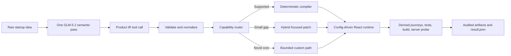

# CompileKit Presentation Guide

## One-sentence explanation

CompileKit turns one natural-language startup idea into a validated Product IR, compiles that IR into a working application with deterministic software, verifies the product, and records independently audited token usage.

## The core insight

Traditional coding agents spend expensive model output tokens writing the same application plumbing repeatedly: forms, CRUD, filters, persistence, tests, and build fixes.

CompileKit separates the work:

- The model handles the semantic problem once: understand the user, resolve ambiguity, choose the data model, and define required behavior.
- Deterministic code handles repeatable engineering: validation, compilation, UI behavior, persistence, testing, build verification, artifacts, and telemetry.

This is closer to a compiler than a code generator. The model produces a small intermediate representation, not a React codebase.

## Architecture



### 1. Semantic interpretation

`solution/system-prompt.md` instructs the model to interpret the idea once and call `compile_product` with a complete Product IR.

The Product IR captures:

- product name, audience, description, and interaction genome;
- entities and typed fields;
- required capabilities;
- filters and calculations;
- persistence;
- assumptions, exclusions, and genuinely custom requirements.

The tool schema is defined in `solution/extensions/product-compiler.ts`. The reusable TypeScript contract, strict validation, and normalization live in `solution/ir/`.

### 2. Product genomes

`solution/genomes/index.ts` provides five reusable interaction shapes:

| Genome | Typical product |
|---|---|
| Tracker | Collections, logs, personal records |
| Workflow | Status-driven pipelines |
| Catalog | Searchable libraries and inventories |
| Planner | Tasks, schedules, and plans |
| Dashboard | Metrics and grouped data |

The genome changes the product vocabulary and expected interaction profile without introducing domain-specific source code.

### 3. Capability routing

`solution/compiler/capability-map.ts` compares the Product IR with the deterministic runtime.

- **Compile:** every required behavior is supported. Compile, test, and terminate without another model response.
- **Hybrid:** the runtime provides the product shell; the model implements only a small unsupported interaction.
- **Custom:** the product's core interaction is novel and needs focused custom code.

Hybrid and custom paths are limited to two model repair attempts. They do not allow the model to rewrite the generic runtime.

### 4. Deterministic compilation

`solution/compiler/compile.ts` converts Product IR into `product.config.json`, `product-ir.json`, `idea_spec.json`, `summary.md`, and compiler state.

The React runtime in `app-template/src/` interprets the configuration. It provides:

- create, edit, and delete;
- required-field and type validation;
- search, preset filters, and sorting;
- category/status grouping;
- count, conditional count, and sum summaries;
- localStorage persistence and damaged-data recovery;
- responsive and accessible empty, error, and success states.

The repository boundary in `app-template/src/repository.ts` keeps persistence separate from UI logic, making a future backend possible without rewriting the interface.

### 5. Autonomous QA and repair

`solution/qa/derive-journeys.ts` derives tests from the Product IR. It does not use one fixed book-specific checklist.

The compiler runs:

1. the configuration-driven application journey;
2. the TypeScript and Vite production build;
3. a deterministic repair for known configuration failures, when applicable.

The outer runner then independently repeats verification:

- Vitest must contain real completed tests with no skipped or todo cases;
- the production build must pass;
- the app must start and answer at `http://localhost:3000`;
- required artifacts must be valid;
- port ownership must be clean after execution.

The model cannot declare itself successful. `src/run-challenge.ts` and `src/result.ts` own the final verdict.

### 6. Token governance and telemetry

Output tokens are the most expensive part of the published scoring formula, so CompileKit avoids generating application source when the runtime already supports the idea.

The formula is:

```text
weighted expenditure = input + output × 3 + cache read × 0.1
```

`solution/orchestrator/budget.ts` limits repair attempts and estimates route cost. The Berget GLM profile explicitly disables chat-template thinking for normal runs. The stable prompt prefix also benefits from inexpensive cache reads.

`src/usage.ts` calculates usage from Pi's JSON event stream. The model never writes headline token totals. `src/validate-result.ts` reconciles the final result against its call log.

## Public prompt example

The public idea asks for a personal book tracker. The model converted it into:

| User language | Product IR decision |
|---|---|
| “title” and “who wrote it” | Required `title` and `author` text fields |
| “novel or cookbook or reference” | Category field with suggestions and custom values |
| “note down their name” | Optional `borrower` text field |
| “clear that off” | Edit the record and empty `borrower` |
| “just the ones currently out” | `borrower nonEmpty` preset filter |
| “how many are lent out” | Conditional count summary |
| “fix it or take it off” | Edit and delete capabilities |
| “just me on my computer” | No authentication; localStorage persistence |

That became a tracker genome with four fields, nine supported capabilities, two filters, one live calculation, and ten derived journeys. No book vocabulary exists in the reusable compiler or runtime; the public fixture is isolated under `benchmarks/public-fixture.ts`.

## Historical measured result (replace from frozen final evidence)

The figures below came from an earlier public run using Berget `zai-org/GLM-5.2` inside the pinned Node.js 22.19.0 Docker image. They are provenance for the optimization story, not the current submission claim. Before presenting, replace this table from `submission/verification/result.json`; if no frozen bundle exists, describe these values only as historical.

| Measure | Result |
|---|---:|
| Status | Success |
| Route | Compile |
| Model calls | 1 |
| Input tokens | 185 |
| Output tokens | 679 |
| Cache-read tokens | 2,944 |
| Reasoning tokens | 0 |
| Weighted token expenditure | 2,516.4 |
| Derived journeys | 10/10 passed |
| Outer harness checks | 4/4 passed |

An earlier provider configuration consumed 24,643.4 weighted tokens. Explicit thinking control plus one-call compilation reduced that measured run to 2,516.4, approximately a 90% reduction. The frozen final bundle is the authority for the submitted run.

## Five-minute talk track

### 0:00–0:30 — Hook

> Most coding agents pay the model to rediscover forms, CRUD, filters, storage, and tests for every startup idea. CompileKit asks the model only the question it is uniquely good at: what product does this person actually need?

### 0:30–1:15 — Problem and insight

> In this competition, output tokens cost three times as much as input tokens. Generating an entire React codebase is both expensive and unreliable. Most MVPs share a small set of interaction genomes, so we move repeated engineering out of the model and into a deterministic compiler.

### 1:15–2:15 — Architecture

> One model call converts the raw idea into a strict Product IR. The IR contains the entity schema, capabilities, filters, calculations, assumptions, and exclusions. A capability router chooses compile, hybrid, or custom. The normal compile route writes configuration into a domain-neutral React runtime, derives journeys, runs tests and a production build, and terminates the model session.

### 2:15–3:15 — Live example

> For the book idea, the agent inferred four fields: title, author, category, and borrower. An empty borrower means on the shelf; a non-empty borrower means lent out. From that single rule it generated the lent-out filter, return transition, and live count. The app groups books by category and stores everything locally because the prompt says it is for one person on one computer.

### 3:15–4:15 — Trust and resilience

> The model cannot mark its own work as passed. The compiler tests the dynamic journeys, and the outer harness independently runs Vitest, builds the app, starts the server, probes port 3000, validates artifacts, and computes usage from Pi's raw event stream. If a capability is not supported, the router allows only a focused patch and at most two repair attempts.

### 4:15–5:00 — Result

> In the historical measured run, one model call used 185 input tokens, 679 output tokens, no reasoning tokens, and 2,516.4 weighted expenditure; all ten product journeys and all four outer checks passed. I will use the frozen submission result for the final numbers. CompileKit is not trying to be a better typist; it is turning the coding agent into a product compiler.

## Demo sequence

The generated application is currently available at `http://localhost:3000`.

1. Show `contract-public/development-idea.txt` to establish that the input is ordinary user language.
2. Open the app and add a book:
   - Title: `Dune`
   - Author: `Frank Herbert`
   - Category: `Novel`
   - Borrowed by: `Alex`
3. Point out the `Novel` group and the live lent-out count.
4. Select the `Lent out` filter.
5. Edit `Dune`, clear `Borrowed by`, and show the count update.
6. Refresh the page to demonstrate persistence.
7. End on the audited result:

```bash
jq '{status, model_calls, input_tokens, output_tokens, cache_read_tokens, reasoning_tokens, weighted_token_expenditure}' output/app/result.json
```

Keep the product demo under 90 seconds. Do not spend presentation time scrolling through source files.

## Likely judge questions

### “Is this just a hardcoded book template?”

No. The reusable runtime contains no book vocabulary. It interprets arbitrary entity names, fields, field types, filters, summaries, colors, and capabilities. The book-specific fixture is isolated from reusable modules. The benchmark suite contains 120 diverse raw ideas to test generality; the full model benchmark remains the final validation task.

### “What exactly does the model do?”

It performs semantic product work: identify the target user, choose the product genome, define the data model, resolve ambiguity, select capabilities, create filters and calculations, and record assumptions and exclusions. It submits that decision as one typed tool call.

### “Why is this an agent if most work is deterministic?”

The agent autonomously interprets an ambiguous goal, scopes the MVP, chooses a route, triggers compilation, evaluates results, and invokes bounded repair when needed. Deterministic execution makes those decisions reliable and inexpensive.

### “What happens with an idea the runtime cannot express?”

The capability router chooses hybrid or custom. The compiler still creates the supported shell, then asks the model to implement only the explicitly unsupported interaction. Verification and a two-attempt repair ceiling still apply.

### “How do you know the app really works?”

Success requires both Product-IR-derived journeys and independent outer checks. The outer harness owns the final result, not the model. It requires real tests, a successful build, a live HTTP response, valid artifacts, and reconciled telemetry.

### “Why localStorage?”

The public prompt specifies one user on one computer, so a backend and authentication would add cost without user value. Persistence is behind a repository interface, so products that genuinely need an API can evolve without coupling storage to the UI.

### “Can the token number be manipulated?”

The runner derives it from completed Pi event records and stores a per-call log. The validator recomputes the totals and the published weighted formula. The model does not author `result.json`.

### “What are the current limitations?”

The fastest deterministic route focuses on single-entity operational MVPs. Multiple editable entities and novel interactions may use the bounded hybrid/custom route. The public run is verified, but the full 120-idea model benchmark has not yet been completed, so do not claim its target percentages yet.

## Phrases to remember

- “The model resolves meaning; the compiler supplies machinery.”
- “One semantic call, deterministic execution.”
- “Product IR instead of source-code generation.”
- “The model cannot grade its own work.”
- “We optimize the published scoring formula without sacrificing product journeys.”
- “Unsupported novelty is isolated, not allowed to rewrite the whole application.”
